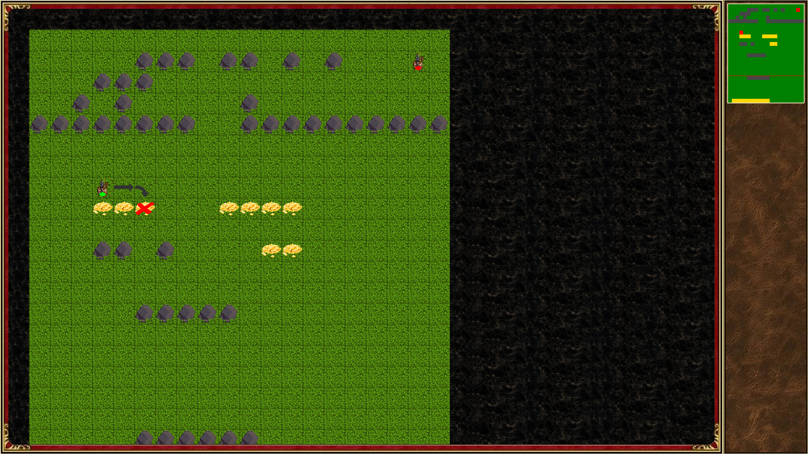

# project-heroes
## Авторы
Сироткин Семен, Зубарев Филипп
##Описание идеи
Данный проект представляет собой игру, реализованную на pygame. 
В данной пошаговой  игре вы и ещё максимум 3 игрока сражаются друг против дргуа на обширной карте.
Вам предстоит сражатся за артефакты и существ, которых вы сможете использовать в боях.
Выигрывает последний выживший из всех игроков на карте.
## Описание реализации
В игре есть карта мира (класс Field), на которой находятся игроки, нейтральные существа и их жилища, артефакты и карта сражений, 
на которой два игрока игрока сражаются (функция fight). При создании поля Field загружается карта из текстого файла, производятся действия необходимсые дял отрисовки на экране,
строится граф, необходимый для реализации передвижения героев по карте (билиотека networkx).

В игре пристутсвуют 12 существ с их жилищами, где их можно нанять за кучки золота в инвентаре героя, 23 предмета которые отличаются друг от дрга,
и которые автоматически надеваются при подборе, если они лучше чем те, которые уже были надеты. Также нельзя иметь больше 30 предметов, включая кучи золота, 7 типов войск.

##Необходимые библиотеки и импользуемые технологии
pygame -основная библиотека,
networkx - для передвижения по карте
 и другие вспомогательные библиотеки.

##Скриншоты игры

